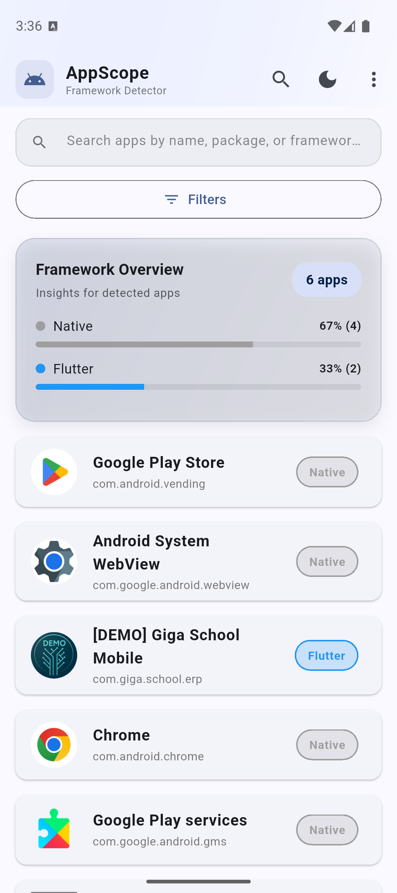
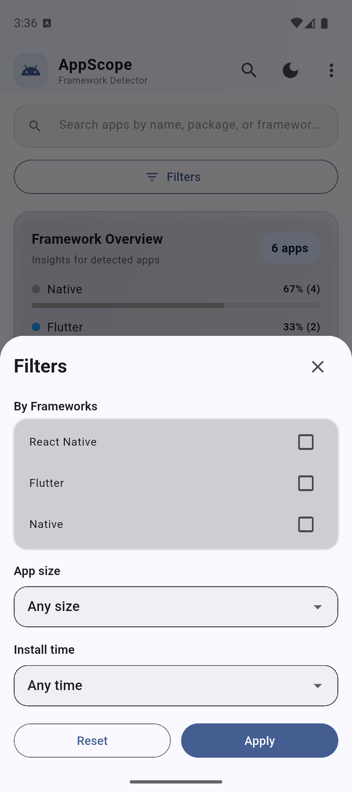

# AppScope

AppScope is a Flutter utility (maintained by [@iamnabink](https://github.com/iamnabink)) that scans Android devices for installed applications, detects their underlying app frameworks, and gives you detailed insights—including APK metadata, SDK targets, install date, size, and more. You can jump into a dedicated detail screen for each app and trigger an uninstall workflow with confirmation and loader states.

## ✨ Features

- **Smart app scanner** – Enumerates installed Android apps via a native Kotlin bridge.
- **Framework detection** – Inspects APK contents to identify Flutter, React Native, Unity, or Native stacks.
- **Detail view** – Shows versioning, install date, SDK targets, APK path, size, system flags, and icon.
- **In-app uninstall** – Launches the system uninstall sheet (with loader + confirmation).
- **Slick loading states** – Shimmer placeholders on both the home list and detail screen while data loads.

## 📸 Screenshots (recommended)

<p align="center">
  
  
</p>

## 🏗️ Tech Stack

- **Frontend:** Flutter (Material 3, Dart 3)
- **Native bridge:** Kotlin `MethodChannel` integrating with Android PackageManager
- **Key packages:** `path`, `path_provider`, `archive`, `shimmer`

## 🚀 Getting Started

### Prerequisites

- Flutter SDK 3.x
- Android Studio / VS Code with Flutter tooling
- Android device or emulator with API level meeting the configured `minSdk` (Flutter default, currently 21+)
- For device testing, enable USB debugging and grant package-query permissions if prompted

### Clone the repository

```bash
git clone https://github.com/iamnabink/appscope_app_info.git
cd appscope_app_info
```

### Install dependencies

```bash
flutter pub get
```

### Run on Android

```bash
# Start emulator or connect device first
flutter run
```

> **Note:** Native changes (Kotlin/Manifest) require a full rebuild (`flutter clean && flutter run`). Hot reload won’t pick up those updates.

### Build APK

```bash
flutter build apk --release
```

APK output: `build/app/outputs/flutter-apk/app-release.apk`

## 🔑 Permissions

The app requires:

- `QUERY_ALL_PACKAGES` – to list installed apps (limited to your own devices/test builds).
- `REQUEST_DELETE_PACKAGES` – to initiate uninstall requests.

If publishing publicly, review Google Play policies and request exemptions or redesign scanning to comply.

## 🧠 How Framework Detection Works

1. Native layer enumerates installed packages, returning metadata + icons over a platform channel.
2. Flutter layer iterates through the result set, downloading APK bytes lazily.
3. The `FrameworkDetector` (Dart) treats the APK as a ZIP and looks for framework signatures:
   - `flutter_assets`, `libflutter.so`
   - `libreactnativejni.so`, `index.android.bundle`
   - `libunity.so`, `UnityPlayer` classes
4. Anything unmatched defaults to `Native`.

## 🧹 Project Structure

```
lib/
  main.dart                 # App list, shimmer loaders, navigation
  models/app_info.dart      # Data model + framework enum
  screens/app_details_screen.dart
  services/
    app_scanner.dart        # MethodChannel + uninstall API
    framework_detector.dart # APK inspection logic
android/app/src/main/kotlin/
  .../MainActivity.kt       # getInstalledApps, getAppDetails, uninstallApp
```

## 🧪 Testing Tips

- Use real devices with multiple framework apps installed for best coverage.
- Verify uninstall flow (system prompt) and ensure logs show `uninstallApp` invocations.
- Validate shimmer loaders by running on slow devices/emulators or throttling CPU.

## 🤝 Contributing
Contributions are welcome on [GitHub](https://github.com/iamnabink/appscope_app_info):

1. Fork the repo and create a feature branch.
2. Keep code formatted (`flutter format .`) and linted (`flutter analyze`).
3. Open a PR describing the change, ideally with screenshots or recordings.

## 👤 Developer

- **Name:** Nabraj Khadka  
- **Website:** [whoamie.com](https://www.whoamie.com/)
- **GitHub:** [@iamnabink](https://github.com/iamnabink)
- **LinkedIn:** [linkedin.com/in/iamnabink](https://www.linkedin.com/in/iamnabink/)
